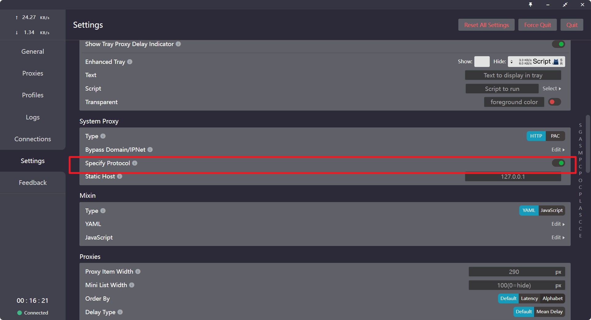
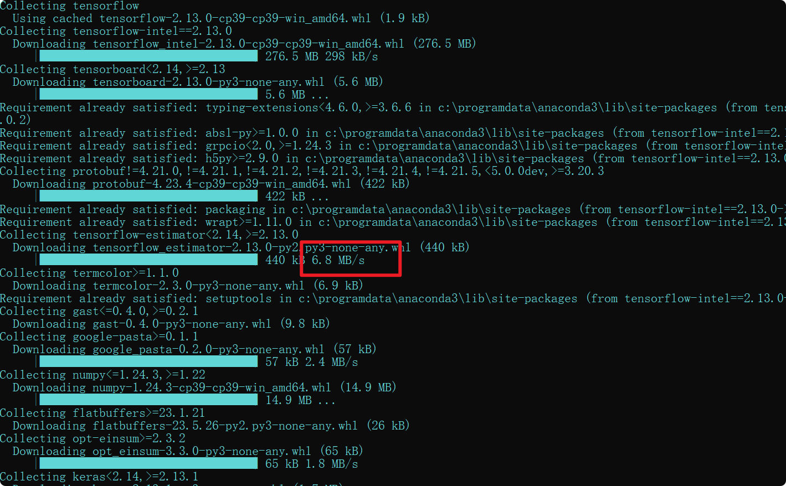

# 最正确的解决ValueError: check_hostname requires server_hostname
网上一众博客解决方式全是关闭代理。
但当你下载一个包，发现国内镜像源没有这个包，不得不使用这个包时，你只能去国外下载。
这个时候不通过代理下载无疑是一种很慢的做法。
### 解决方式
去你所用的代理软件的GitHub去翻issue。
例如，启用clash的启用Specify Protocol

在pip时设置代理，直接在pip时设置代理即可：pip install some-package --proxy=http:// 代理服务器IP:端口号

